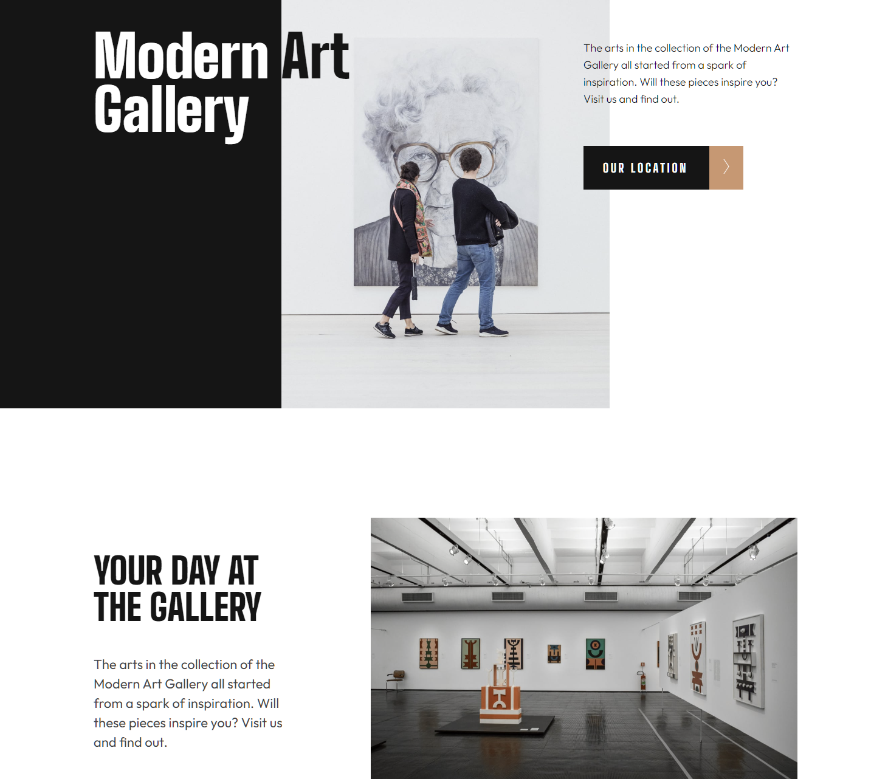
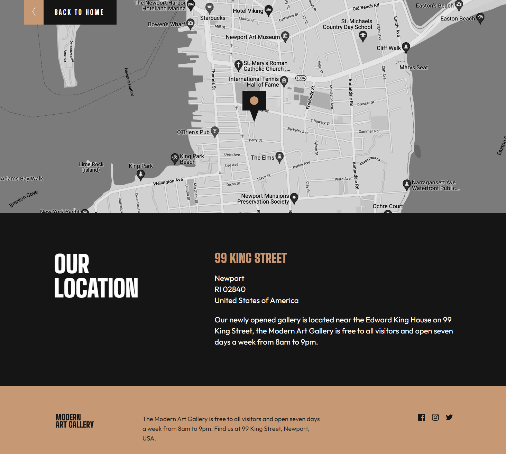

# Frontend Mentor - Art gallery website solution

This is a solution to the [Art gallery website challenge on Frontend Mentor](https://www.frontendmentor.io/challenges/art-gallery-website-yVdrZlxyA). Frontend Mentor challenges help you improve your coding skills by building realistic projects. 

## Table of contents

- [Overview](#overview)
  - [Links](#links)
  - [The challenge](#the-challenge)
  - [Screenshot](#screenshot)
  - [Built with](#built-with)
- [Author](#author)

## Overview

### Links

- [Solution URL](https://github.com/anton-zykov/fm-art-gallery)
- [Live Site URL - GitHub Pages](https://anton-zykov.github.io/fm-art-gallery/)

### The challenge

Users should be able to:

- View the optimal layout for main and location pages depending on their device's screen size and resolution
- See hover states for all interactive elements throughout the site

### Screenshots

### Built with

- Semantic HTML5 markup
- Pure CSS
- BEM
- Mobile-first workflow

## Author

- Frontend Mentor - [@anton-zykov](https://www.frontendmentor.io/profile/anton-zykov)
- LinkedIn - [anton-zykov-916a06248](https://www.linkedin.com/in/anton-zykov-916a06248/)
